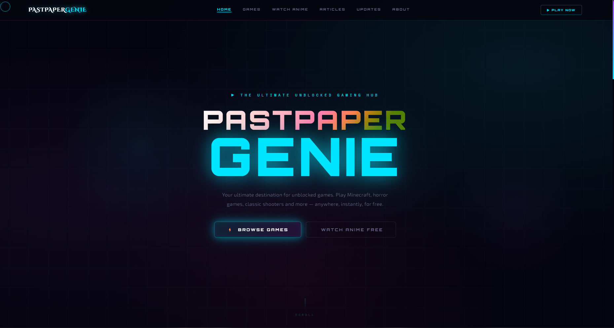

# 🧞‍♂️ PastPaperGenie

**PastPaperGenie** is the ultimate web-based hub for unblocked games and free anime streaming. Built with a highly responsive, custom-animated cyberpunk UI, it allows users to play over 730+ classic and modern browser games instantly—no downloads, no installations, and no blocks.

---

## ✨ Features

*   **🎮 Massive Game Library (730+ Titles):** Instantly play popular games directly in the browser. Featured games include:
    *   *Minecraft 1.20.4* (WASM/JS build)
    *   *Five Nights at Freddy's (FNAF)*
    *   *Undertale*
    *   *Kirka.io*
    *   *Friday Night Funkin'*
    *   *Geometry Dash Lite*
*   **📺 Anime Hub:** A dedicated section for streaming anime for free.
*   **📚 Knowledge Base & Articles:** Integrated blog sections for game guides, lore deep-dives, and updates.
*   **🌌 Premium UI/UX:** 
    *   Custom neon color palette with smooth CSS animations (glitch effects, floating orbs, neon pulses).
    *   Custom dynamic cursor with trailing ring effects.
    *   Seamless page transitions using vanilla JavaScript.
*   **📱 Fully Responsive:** Carefully optimized grid layouts that work flawlessly across desktop, tablet, and mobile devices.

---

## 📸 Glimpse of the UI


---
## 🎬 Deep Dive: Anime Streaming Hub (`/anime/`)

The Anime Streaming Hub is a fully custom, serverless web application built directly into PastPaperGenie. It allows users to search, discover, and stream thousands of anime titles for free without leaving the site. 

### ✨ Key Features

*   **Massive Anime Database:** Powered by the **AniList GraphQL API**, the page dynamically fetches high-quality cover art, localized titles (Dub/Sub), and episode counts in real-time.
*   **Seamless Streaming Integration:** Video playback is handled seamlessly through an embedded iframe utilizing the `megaplay.buzz` streaming backend. 
*   **Smart Episode Routing:** Dynamically generates episode selection grids based on the specific anime's total episode count (handling up to 1,500+ episodes).
*   **Cloud Progress Tracking (Firebase):** Users can log in using Google Authentication. Their watch progress (current anime, episode number) is automatically saved to **Cloud Firestore** so they can pick up right where they left off.
*   **Immersive Cyberpunk UI/UX:** 
    *   **Custom Interactions:** Features a custom trailing cursor (`#cdot` and `#cring`) that expands over interactive elements.
    *   **Dynamic Backgrounds:** Utilizes CSS-only floating orbs, moving grid lines, and glowing neon pulses for a high-end, futuristic feel.
    *   **Glassmorphism:** A frosted-glass navigation bar (`backdrop-filter: blur`) ensures the UI stays clean over the complex animated background.

### 🛠️ Technical Architecture

The page is built to be lightweight and fast, relying on vanilla web technologies and modern cloud services rather than heavy frontend frameworks.

*   **Frontend:** HTML5, Vanilla CSS3 (CSS Variables, Keyframe Animations), and Vanilla JavaScript (ES6).
*   **Data Fetching:** Fetch API used to send `POST` requests to `https://graphql.anilist.co`.
*   **Authentication & Database:** Firebase v10 (Modular SDK) handling Google Auth (`signInWithPopup`) and Firestore document writes/reads.
*   **Monetization & Analytics:** Pre-configured with Google AdSense and Google Analytics (gtag.js).

### 🔍 How It Works Under the Hood

1.  **Initial Load:** The page immediately fires `loadRecommended()`, querying the AniList API for a hardcoded array of popular anime IDs to populate the "Trending Hits" feed.
2.  **Search Functionality:** When a user types a query, `searchAnime()` sends a GraphQL search request to AniList, replacing the grid with relevant results.
3.  **Video Player Instantiation:** Clicking an anime card triggers `selectAnime()`. This hides the search grid, reveals the video player (`#playerView`), and dynamically renders a button for every episode.
4.  **Playback & Tracking:** Clicking an episode button updates the video iframe `src`, highlights the active episode via DOM manipulation, and triggers `saveEpisodeProgress()` to sync the user's location to Firebase.

## 🛠️ Tech Stack

This project is built using purely static front-end technologies, making it lightning-fast and incredibly easy to host:

*   **HTML5:** Semantic structure and SEO metadata.
*   **CSS3:** Native CSS variables, complex keyframe animations, flexbox/grid layouts, and glassmorphism (backdrop-filters).
*   **Vanilla JavaScript (ES6+):** Intersection Observers for scroll reveals, custom mouse tracking, and smooth page transition routing.
*   **Fonts:** Google Fonts (*Orbitron, Exo 2, Space Mono, Cinzel Decorative*).

---

## 🚀 Getting Started

Since PastPaperGenie is a static site, setup is practically instantaneous.

### Prerequisites
You only need a modern web browser. No Node.js, Python, or database setup is required.

### Local Development
1. Clone the repository:
   ```bash
   git clone [https://github.com/flashedcode/pastpapergenie.git](https://github.com/flashedcode/pastpapergenie.git)
